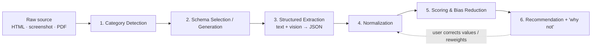

# AI Intelligence — How the "Smartness" Is Built

> **AS-BUILT (Milestone 1).** This pipeline is implemented in `src/ai/`, running **entirely in the
> browser** behind one `ExtractionProvider` interface with three interchangeable backends:
> **Claude** (`src/ai/claude.ts`, browser SDK + vision, `claude-opus-5`), **WebLLM** (`src/ai/webllm.ts`,
> keyless in-browser via WebGPU), and **Sample** (`src/ai/sample.ts`, keyless local regex parsing).
> The detect → schema → extract → normalize → score → explain shape below is real code:
> `detect.ts`/`llm.ts` (category + schema), `src/schemas/seeded.ts` (Tier-1 seeded schemas +
> LLM-generated fallback for unknown categories), `src/ingest/pipeline.ts` (Tier-2 page-found rows),
> and `src/scoring/` (the consensus engine). Every extracted value carries **confidence + provenance**,
> and missing fields are `"Unknown"`, never zero — exactly as specified.

This is the heart of Compare and the piece the product lives or dies on. The user's ask:

> "The system should understand the context and put the right parameters while doing the
> comparison. For insurance it checks the parameters critical for buying insurance; for a car it
> tells me make, model, year, kilometers driven, scratches, owner… I want you to suggest how this
> smartness can be built."

The answer is a **pipeline of narrow, verifiable AI steps** rather than one big "compare these"
prompt. Each step does one thing, produces structured output, and can be inspected and corrected.
That keeps the system **relevant** (right parameters per category) *and* **trustworthy**
(explainable, editable, not a black box).

## The pipeline



---

### Step 1 — Category detection
An LLM reads the ingested content (page text, or a vision model reads the screenshot/PDF) and
classifies **what** is being compared: `insurance`, `used-car`, `phone`, `credit-card`,
`apartment-rental`, … It returns the category plus a confidence. If confidence is low or the user
disagrees, the user can pick/override the category. Detecting the category *before* extraction is
what lets everything downstream use the *right* parameters.

### Step 2 — Schema selection / generation (the core idea)
A **Category Schema** is the list of parameters that matter for a category, each with a type, a
unit, a **weight** (how much it matters by default), and a **direction** (is higher or lower
better). The schema is what makes the comparison relevant.

Two ways a schema is obtained:

1. **Seeded schemas** for common categories — curated, high quality, versioned. Examples:

   *Insurance:* premium, coverage amount, deductible, claim-settlement ratio, network size,
   waiting period, exclusions, add-ons, tenure.
   *Used car:* make, model, year, kilometers driven, number of owners, condition/scratches,
   accident history, service records, fuel type, transmission, price.
   *Phone:* chip, RAM, storage, battery, display, camera, OS support window, warranty, price.

2. **LLM-generated schema fallback** — for a category with no seeded schema, an LLM **generates
   the parameter set on the fly** ("what does a careful buyer compare when buying X?"), which is
   then cached and can be promoted to a curated schema. This is how the tool "tells you the right
   parameters" for anything, not just pre-built categories.

Schemas are **versioned and editable**, so they improve over time and users/experts can refine
them.

```
CategorySchema {
  category: "used-car"
  version: 3
  parameters: [
    { key: "year",            type: int,      direction: higher_better, weight: 0.15 },
    { key: "km_driven",       type: int,      unit: "km", direction: lower_better, weight: 0.20 },
    { key: "owners",          type: int,      direction: lower_better, weight: 0.10 },
    { key: "condition",       type: enum,     direction: higher_better, weight: 0.15 },
    { key: "service_history", type: bool,     direction: higher_better, weight: 0.10 },
    { key: "price",           type: money,    direction: lower_better, weight: 0.30 },
    ...
  ]
}
```

### Step 3 — Structured extraction (text + vision → strict JSON)
For each source, an LLM extracts values **against the chosen schema**, using **tool/function
calling to force valid, typed JSON** (no free-text parsing). When the input is a screenshot or a
scanned PDF, a **vision-capable model** reads it directly. Every field carries:

- **value** (typed and, where possible, already in a canonical form),
- **confidence** (so the UI can flag shaky extractions),
- **provenance** (which source and where the value came from — builds trust and enables review).

Missing values are marked "unknown" rather than guessed, so the comparison never invents data.

### Step 4 — Normalization
Values from different sites arrive in different units and formats. This step reconciles them:
currency (₹/$/€), units (km vs. miles, GB vs. TB), ranges vs. points, and enum canonicalization
("Excellent" vs. "Very good"). Only after normalization are cells truly comparable.

### Step 5 — Scoring & bias reduction
The goal is to **narrow to one** without hiding the reasoning:

- **Weighted score** per option from the schema weights — but weights are **exposed and
  re-weightable** by the user, because the "best" choice depends on *their* priorities. This is
  the central bias-reduction lever: the user's real preferences, made explicit, drive the ranking.
- **Dominated-option detection** — flag any option that is worse on every axis the user cares
  about; these can be confidently dropped.
- **Trade-off surfacing** — where options genuinely trade off (cheaper but higher deductible),
  say so explicitly instead of collapsing it into a single opaque number.
- The scoring **math is deterministic and visible**; the LLM contributes weights and explanations,
  not a hidden verdict.

### Step 6 — Recommendation + "why not the others"
An LLM produces a **plain-language recommendation** with **pros/cons** and, crucially, a
**"why not the others"** for each rejected option. This directly powers the **decision journey**:
each elimination gets a human-readable reason, so the narrowing funnel tells a story the user (and
anyone they share with) can follow.

### Human-in-the-loop (across the pipeline)
- The user can **correct any extracted value** (fixing an OCR miss or a wrong scrape).
- The user can **re-weight parameters** and instantly see the ranking update.
- The user can **override the category/schema**.
- Corrections and re-weightings are signals that can improve seeded schemas and extraction over
  time.

---

## Why this design reduces bias (the product's real purpose)
- Parameters are chosen by **category relevance**, not by whichever site shouted loudest.
- The user's own priorities are made **explicit and adjustable**, instead of implicit.
- Every value has **provenance and confidence**, so persuasion and cherry-picking are visible.
- Eliminations are **reasoned and recorded**, so the decision is auditable, not impulsive.

## Implementation notes (for the build phase)
- Built on **Claude** for classification, structured extraction (tool calling), vision
  (screenshots/PDFs), and rationale generation.
- **Prompt-caching** the schema and instructions across an option-set keeps repeated extractions
  cheap; **cache extractions** so shared/repeat views cost nothing.
- Keep each step's prompt **narrow and testable**; evaluate extraction accuracy per category with
  a small labeled set before expanding categories.
- Before writing any Claude API code, consult the **`claude-api` skill** for current model IDs,
  tool-calling, vision, prompt-caching, and cost guidance — do not hardcode model choices from
  memory.

> All model/provider choices are proposals to confirm with the PRD. The *pipeline shape*
> (detect → schema → extract → normalize → score → explain, with a human in the loop) is the
> durable part of this design.
