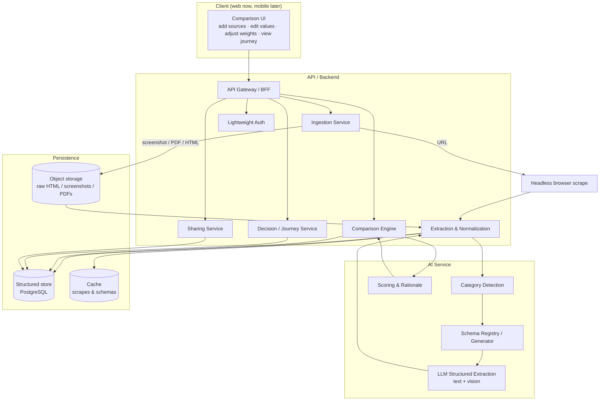

# Architecture — Compare

> **Web-first, mobile-ready.** The system is drawn so a native mobile client can later reuse the
> same API and services. Framework/stack names below are a **recommended proposal** to confirm
> against the PRD, not a lock-in.

## 1. High-level flow



## 2. Components

### 2.1 Client
Responsive web app. Responsibilities: collect sources (link/upload), render the side-by-side
comparison, let the user **edit extracted values** and **adjust parameter weights**, and show the
**decision journey**. Kept thin — all intelligence lives server-side so a future mobile client
reuses it.

### 2.2 Ingestion Service
Accepts an input and routes it by type:

| Input type | Strategy |
|---|---|
| **URL / link** | Headless-browser render + scrape (handles JS-heavy pages); store raw HTML snapshot |
| **Screenshot / image** | Store image → vision-model extraction (OCR + layout understanding) |
| **PDF** | Text-layer extraction where present; vision extraction for scanned/image PDFs |
| **Raw HTML** | Parse directly |

Raw artifacts go to **object storage**; a normalized, structured record is produced downstream.
Handles retries, and surfaces "couldn't extract — try a screenshot instead" as a first-class path
(some sites block scraping).

### 2.3 Extraction & Normalization
Turns messy source content into a **typed record** keyed to a **category schema** (from the AI
service). Then **normalizes** units, currency, ranges, and value formats so options are directly
comparable. Persists the structured record plus **provenance** (which source/field each value
came from) and **confidence**.

### 2.4 Comparison Engine
Aligns multiple records onto the category's parameter set, computes per-parameter deltas, applies
**weighted scoring** (weights are user-adjustable), and identifies **dominated options**. Stays
deterministic and transparent — the AI service supplies weights/rationale, but the math the user
sees is explainable.

### 2.5 Decision / Journey Service
Records the funnel: candidates added, shortlisted, eliminated (**with reasons**), and the final
choice. Produces the shareable "how we got here" narrative/timeline.

### 2.6 Sharing Service
Generates share links for a comparison and/or its journey. Permission model (public vs.
account-gated, view vs. edit) is a PRD open question.

### 2.7 Lightweight Auth
Simple sign-in (magic-link or social). Just enough to own, save, and share comparisons. Not a
heavy identity/SSO system.

### 2.8 AI Service
Category detection, schema selection/generation, structured extraction (text + vision), and
scoring/rationale. Fully specified in [`AI_INTELLIGENCE.md`](AI_INTELLIGENCE.md).

### 2.9 Persistence
- **PostgreSQL** — users, comparisons, options, category schemas, parameter values, journeys,
  share links.
- **Object storage** — raw HTML snapshots, screenshots, PDFs.
- **Cache** — scraped/extracted results and resolved schemas, so repeat and shared views are
  instant (the "scrape once, reuse" requirement).

## 3. Data model (sketch — refine in implementation)

```
User ──< Comparison ──< Option ──< ParameterValue
                     │                     └─ value, unit, confidence, provenance
                     ├─ category ──> CategorySchema ──< Parameter (name, type, weight, direction)
                     ├── Journey ──< JourneyStep (action, option, reason, timestamp)
                     └── ShareLink (scope, permission)

IngestionSource ── belongs to Option (type: url|screenshot|pdf|html; rawArtifactRef; fetchedAt)
```

`Parameter.direction` = whether higher or lower is better (e.g. coverage↑ good, premium↓ good) —
central to scoring and to flagging dominated options.

## 4. Proposed stack (confirm in PRD)

| Layer | Proposal | Why |
|---|---|---|
| Frontend | **Next.js + TypeScript** | SSR + great sharing/SEO for share links; one language across stack |
| API/Backend | **Node/TypeScript** (Next API routes or a separate service) | Shared types with frontend; fast to build |
| AI service | **Python or TypeScript, built on Claude** | Strong vision + structured-output/tool-calling; see AI doc |
| Structured DB | **PostgreSQL** | Relational data (comparisons, schemas, journeys) fits well |
| Object storage | **S3-compatible** | Cheap durable storage for raw HTML/images/PDFs |
| Scraping | **Headless browser** (e.g. Playwright) | Renders JS-heavy pages before extraction |
| Cache | **Redis** (or Postgres-backed) | Instant repeat/shared views |
| Auth | **Magic-link / social** (e.g. Auth.js) | Lightweight by design |

> These are starting recommendations. The PRD may change any of them — the component boundaries
> above matter more than the specific frameworks.

## 5. Cross-cutting concerns
- **Trust/explainability** — extraction confidence + provenance shown in the UI; users can correct
  values, and corrections should feed back over time.
- **Scraping resilience & compliance** — respect robots/ToS; screenshot/PDF upload is the fallback
  when a site can't or shouldn't be scraped.
- **Cost control** — cache aggressively; reuse extractions; see AI doc for model + prompt-caching
  notes.
- **Privacy** — uploaded screenshots/PDFs may contain personal data; define retention with the PRD.
